# Technical Progress & Optimization Report

**Project:** Akbrny (اخبرني) — Anonymous Messages & Polls Platform  
**Branch:** `upgrade/laravel-13`  
**Report date:** 12 August 2026  
**Prepared for:** Client technical review  

---

## Executive Summary

This report documents the work completed on the Akbrny Laravel upgrade branch. The project was migrated from **Laravel 5.8 (PHP 7.1)** to **Laravel 13.24.0 (PHP 8.3 compatible)** while preserving all existing API endpoints, request/response contracts, authentication behavior, and business logic.

The work spans **two major commits** on branch `upgrade/laravel-13`:

| Commit | Date | Scope |
|--------|------|-------|
| `469d783` | 2026-08-08 | Full Laravel 13 upgrade, query optimizations, FCM HTTP v1, tests, documentation |
| `4e4a844` | 2026-08-12 | PHP 8.3 dependency alignment (composer files only) |

**Implemented query optimizations:** 6 discrete improvements (#1–#5, including 4a and 4b) with measured query-count reductions documented in `PERFORMANCE.md`.

**Testing:** 42/42 tests passing (128 assertions) — verified on 2026-08-12.

**Production database:** Not modified during this work. Performance indexes exist as a migration file only; application to production requires explicit approval.

---

## 1. Laravel 13 Upgrade

### Before

| Item | Value |
|------|-------|
| Laravel | 5.8.* (`commit 2be148b`) |
| PHP requirement | `^7.1.3` |
| Structure | Legacy L5.8: `app/Http/Kernel.php`, `RouteServiceProvider`, string-based routes |

### After

| Item | Value |
|------|-------|
| Laravel | **13.24.0** (locked in `composer.lock`) |
| PHP requirement | **`^8.3`** |
| Structure | Laravel 11+ skeleton: `bootstrap/app.php`, class-based routes, consolidated providers |

### What changed (`commit 469d783`)

- **69 files** changed (+10,148 / −3,789 lines)
- Removed legacy middleware stack (`app/Http/Kernel.php`, individual middleware files)
- Removed legacy providers (`RouteServiceProvider`, `EventServiceProvider`, etc.)
- Modernized route syntax: `'Controller@method'` → `[Controller::class, 'method']`
- Updated configuration files to Laravel 13 defaults
- Added `bootstrap/providers.php`
- Removed deprecated packages: `fideloper/proxy`, `laravel/socialite`
- Added `laravel/ui ^4.6` for authentication scaffolding

### Laravel downgrade?

**No.** Laravel was upgraded from 5.8 → 13. No framework downgrade occurred.

**Evidence:** `commit 469d783`, `composer.lock` → `laravel/framework v13.24.0`

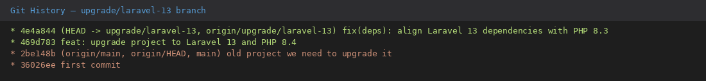

---

## 2. PHP 8.3 Compatibility

### Server context

The target deployment server supports **PHP 8.2 and PHP 8.3 only** (no PHP 8.4).

### Work completed (`commit 4e4a844`)

| Change | Before | After |
|--------|--------|-------|
| `composer.json` PHP constraint | `^8.4` | `^8.3` |
| Composer platform pin | none | `"platform": {"php": "8.3.30"}` |
| Symfony packages | 8.1.x (requires PHP ≥8.4.1) | **7.4.x** (PHP 8.3 compatible) |

**Why Symfony 8.x was incompatible:** When `composer.lock` was originally resolved on PHP 8.4, Composer selected Symfony 8.1.x packages (`symfony/console`, `symfony/error-handler`, etc.) which require `php >= 8.4.1`. These packages blocked deployment on PHP 8.3.

**Why Symfony 7.4.x was selected:** Laravel 13.24.0 declares `"symfony/console": "^7.4.0 || ^8.0.0"`. The platform pin ensures Composer resolves the 7.4 line, which is fully supported by Laravel 13 and runs on PHP 8.3.

**Files changed in `4e4a844`:** Only `composer.json` and `composer.lock`. No application code was modified.

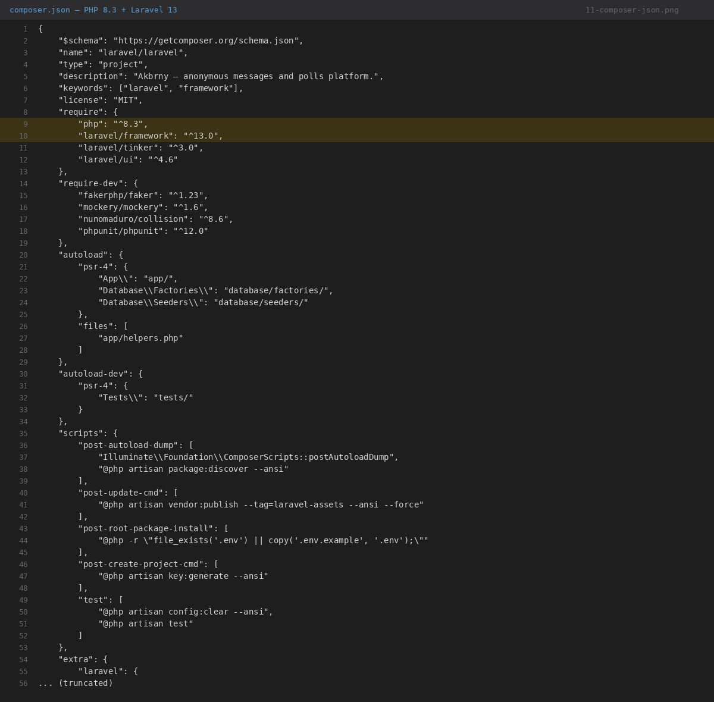

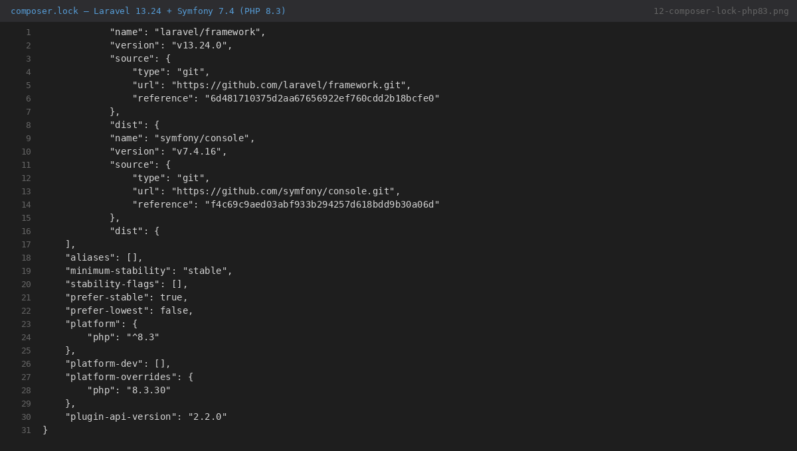

### PHP 8.2 note

Laravel 13 requires PHP **≥ 8.3**. PHP 8.2 is **not supported** and must not be selected on the server.

---

## 3. Dependency Optimization

### Direct dependencies (current)

| Package | Version constraint | Locked |
|---------|-------------------|--------|
| `php` | `^8.3` | platform: 8.3.30 |
| `laravel/framework` | `^13.0` | v13.24.0 |
| `laravel/tinker` | `^3.0` | v3.0.2 |
| `laravel/ui` | `^4.6` | v4.6.3 |

### Dev dependencies

| Package | Purpose |
|---------|---------|
| `phpunit/phpunit ^12.0` | Test runner |
| `nunomaduro/collision ^8.6` | Error rendering |
| `fakerphp/faker ^1.23` | Test fixtures |

### Removed (from Laravel 5.8)

- `fideloper/proxy` — replaced by Laravel built-in trusted proxy handling
- `laravel/socialite` — was not used in routes/controllers
- `beyondcode/laravel-dump-server`, `filp/whoops`, `fzaninotto/faker` — dev tooling replaced

---

## 4. Code Organization

### Project structure

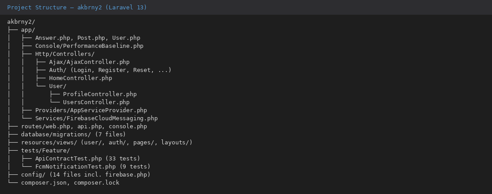

### Responsibility separation

| Layer | Location | Responsibility |
|-------|----------|----------------|
| **Web routes** | `routes/web.php` | URL → controller mapping, middleware groups |
| **Home** | `HomeController` | Landing page |
| **User dashboard** | `User/UsersController` | Authenticated timeline, settings, notifications |
| **Public profile** | `User/ProfileController` | Public profile view, anonymous message submission, FCM trigger |
| **AJAX API** | `Ajax/AjaxController` | 13 JSON/plain-text endpoints for messages, polls, settings, search |
| **Authentication** | `Auth/*Controller` | Login (email or username), register, password reset |
| **Models** | `app/User.php`, `app/Post.php`, `app/Answer.php` | Eloquent relationships (legacy L5.8 location, not `app/Models/`) |
| **FCM service** | `app/Services/FirebaseCloudMessaging.php` | Firebase HTTP v1 notification delivery |
| **View composer** | `AppServiceProvider` | Global unread message count for navbar |
| **Migrations** | `database/migrations/` | Schema definitions and performance indexes |
| **Tests** | `tests/Feature/` | API contract (33) + FCM (9) tests |

### Organization improvements (IMPLEMENTED — `commit 469d783`)

These are **modernization** changes, not a full architectural refactor:

1. **Route syntax modernization** — class-based controller references instead of string syntax; duplicate route groups removed (old code had `/user` routes registered twice)
2. **FCM extracted to service class** — `FirebaseCloudMessaging` replaces inline cURL + hardcoded server key in `ProfileController`
3. **Performance baseline tooling** — `app/Console/PerformanceBaseline.php` + `artisan performance:baseline` command
4. **Test suite added** — `ApiContractTest` (33 tests), `FcmNotificationTest` (9 tests)
5. **Documentation added** — `API_INVENTORY.md`, `PERFORMANCE.md`, `UPGRADE_AUDIT.md`, `PRODUCTION_READINESS.md`

### Pre-existing organization (unchanged conceptually)

- Controllers were already separated into `User/`, `Ajax/`, and `Auth/` subdirectories before the upgrade
- Models were already in `app/` root with Eloquent relationships defined
- AJAX endpoints were already centralized in `AjaxController`

---

## 5. Database Architecture

### Tables (from migrations)

| Migration | Table | Purpose |
|-----------|-------|---------|
| `2014_10_12_000000_create_users_table.php` | `users` | User accounts |
| `2014_10_12_100000_create_password_resets_table.php` | `password_resets` | Password reset tokens |
| `2020_04_12_193813_create_posts_table.php` | `posts` | Messages (type=0) and polls (type=1) |
| `2020_04_13_085736_create_answers_table.php` | `answers` | Replies and poll votes |
| `2026_08_08_034258_create_jobs_table.php` | `jobs` | Database queue (optional) |
| `2026_08_08_034259_create_sessions_table.php` | `sessions` | Database sessions (optional) |
| `2026_08_08_040705_add_performance_indexes...` | indexes on `posts`, `answers` | Performance optimization |

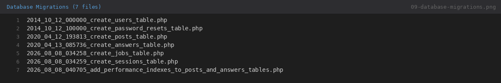

### Database safety

- **Production database was NOT modified** during development or testing of this branch
- Performance index migration is **additive only** (CREATE INDEX, reversible via `down()`)
- Test/staging database: `akbrny_test` (local) / `akbrny2026_akbrny_test` (server test environment)
- No credentials are included in this report

---

## 6. Query Analysis

### Query locations in the application

| File | Query types | Purpose |
|------|-------------|---------|
| `UsersController::index()` | Eloquent `Post::where()->with('answers')->get()`, `Post::where()->update()` | Dashboard timeline + mark-as-read |
| `ProfileController::getUser()` | Eloquent `User::where()->first()`, `Post::where()->with('answers')->get()` | Public profile |
| `ProfileController::senMessageToUser()` | Eloquent `User::where()->first()`, `$post->save()` | Anonymous message |
| `AppServiceProvider::boot()` | `DB::table('posts')->where()->count()` | Navbar unread badge |
| `AjaxController` | `DB::table()` COUNT/INSERT/UPDATE/DELETE/SELECT | All AJAX operations |
| `profile.blade.php` | `auth()->user()->answers()->where('post_id')->first()` | Poll vote display (per poll) |

### Important queries — detail

#### Q1: Dashboard post fetch

- **File:** `app/Http/Controllers/User/UsersController.php`
- **Method:** `index()`
- **Query:**
  ```php
  Post::where('user_id', $userId)->with('answers')->get();
  ```
- **Tables:** `posts`, `answers` (eager-loaded)
- **Purpose:** Load all user posts with answers in 2 queries instead of N+1

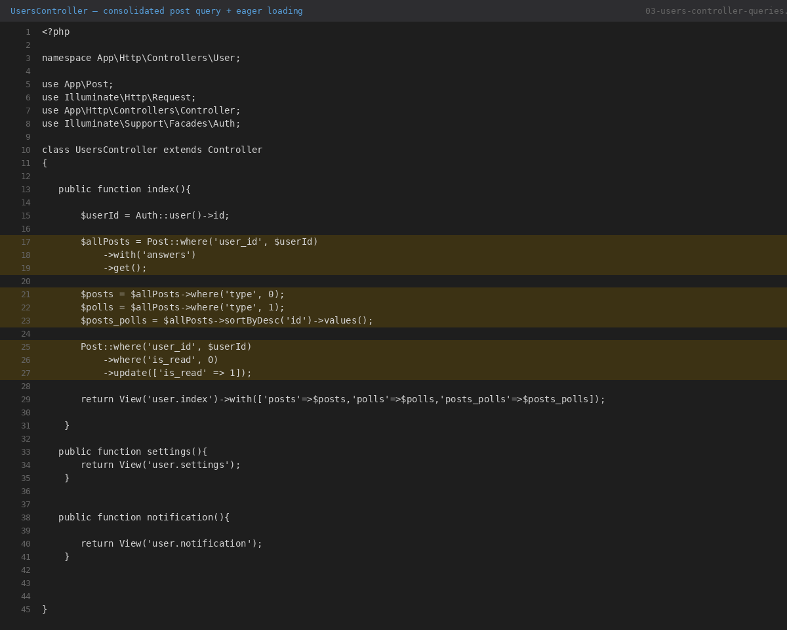

#### Q2: Profile post fetch

- **File:** `app/Http/Controllers/User/ProfileController.php`
- **Method:** `getUser()`
- **Query:**
  ```php
  Post::where('user_id', $user->id)->with('answers')->get();
  ```
- **Tables:** `posts`, `answers`
- **Filtering:** Split in PHP by `type` (0=messages, 1=polls) and `is_public`

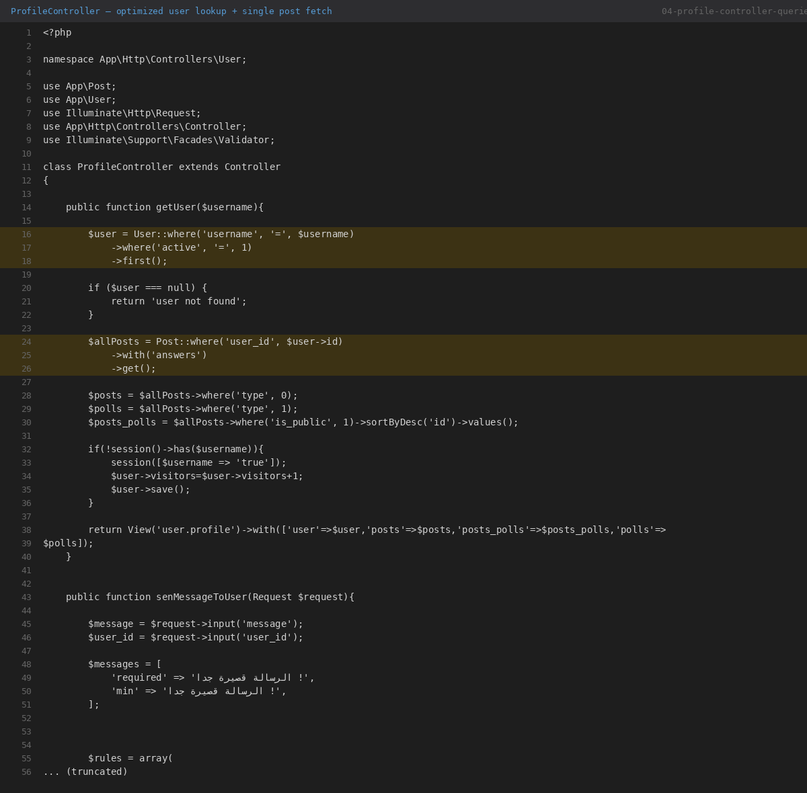

#### Q3: Unread message count

- **File:** `app/Providers/AppServiceProvider.php`
- **Method:** `boot()` — View composer
- **Query:**
  ```php
  DB::table('posts')
      ->where('user_id', '=', auth()->id())
      ->where('is_read', '=', 0)
      ->where('type', '=', 0)
      ->count();
  ```
- **Index benefit:** `posts_user_id_is_read_type_index`

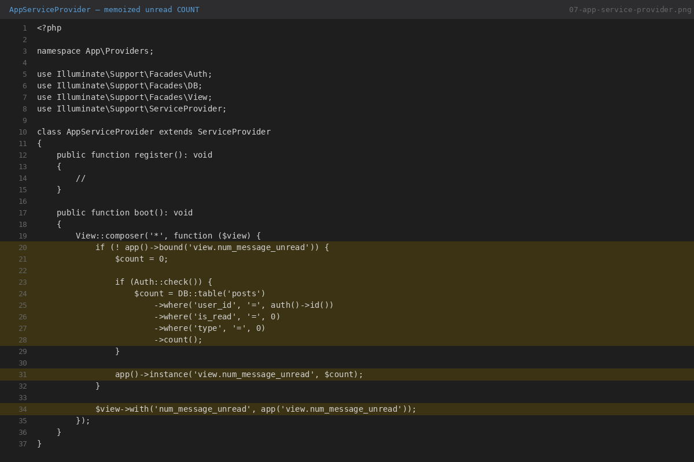

#### Q4: AJAX reply duplicate check

- **File:** `app/Http/Controllers/Ajax/AjaxController.php`
- **Method:** `replyMessage()`
- **Queries:**
  ```php
  DB::table("posts")->where('user_id', ...)->where('id', $message_reply_id)->count();
  DB::table("answers")->where('user_id', ...)->where('post_id', $message_reply_id)->count();
  ```
- **Index benefit:** `answers_user_id_post_id_index` on duplicate check

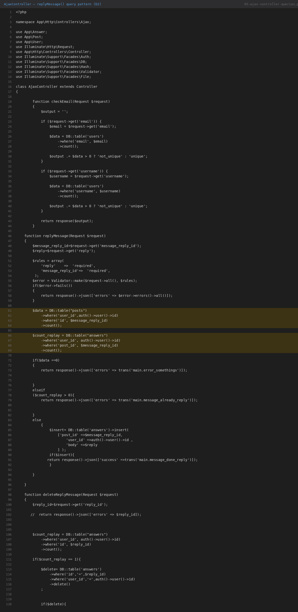

#### Q5: Profile poll vote lookup (view layer)

- **File:** `resources/views/user/profile.blade.php`
- **Pattern:** `auth()->user()->answers()->where('post_id', $post->id)->first()`
- **Note:** Runs once per poll (N queries for N polls). Duplicate lookup eliminated in Opt #4a but not batch-eager-loaded.

### Eloquent models

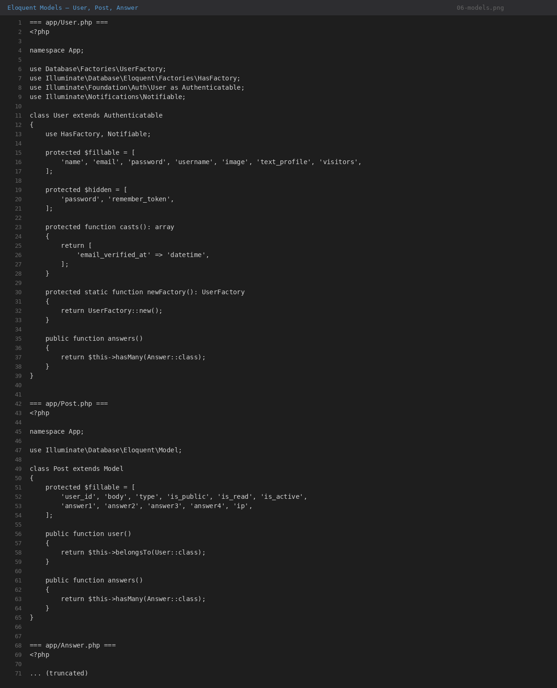

| Model | Relationships |
|-------|---------------|
| `User` | `hasMany(Answer)` |
| `Post` | `belongsTo(User)`, `hasMany(Answer)` |
| `Answer` | `belongsTo(Post)`, `belongsTo(User)` |

---

## 7. Query Optimizations Implemented

All optimizations below were implemented in **`commit 469d783`** and verified with API contract tests (33/33 passing after each change). Measurements documented in `PERFORMANCE.md`.

### Summary table

| # | Optimization | File(s) | Query impact |
|---|-------------|---------|--------------|
| 1 | Eager-load `answers` on timeline | `UsersController`, `ProfileController` | GET `/user`: 18 → 8 queries |
| 2 | Consolidate 3 post queries → 1 | `UsersController`, `ProfileController` | GET `/user`: 8 → 6; GET profile: 7 → 5 |
| 3 | Memoize unread COUNT in view composer | `AppServiceProvider` | −1 query per authenticated page |
| 4a | Deduplicate poll vote lookup | `profile.blade.php` | −1 query per poll (authenticated) |
| 4b | COUNT+SELECT → single SELECT for user | `ProfileController` | −1 query on profile GET and message POST |
| 5 | Composite database indexes | migration `2026_08_08_040705...` | Latency improvement at scale |

### Cumulative measured results (from `PERFORMANCE.md`)

| Endpoint | Baseline (Phase 1) | Final | Query reduction |
|----------|-------------------|-------|-----------------|
| GET `/user` | 18 queries, 20.01 ms | **5 queries, ~10 ms** | **−72%** |
| GET `/{username}` | 12 queries, 7.98 ms | **4 queries, ~5 ms** | **−67%** |
| GET `/user/settings` | 3 queries | **2 queries** | **−33%** |
| GET `/user/notification` | 3 queries | **2 queries** | **−33%** |

> **Note:** Wall-clock times include PHP bootstrap and view rendering; they vary between runs (±30%). Query-count reductions are deterministic. Index benefits (#5) are most visible on production-sized tables.

### Before/after evidence — UsersController

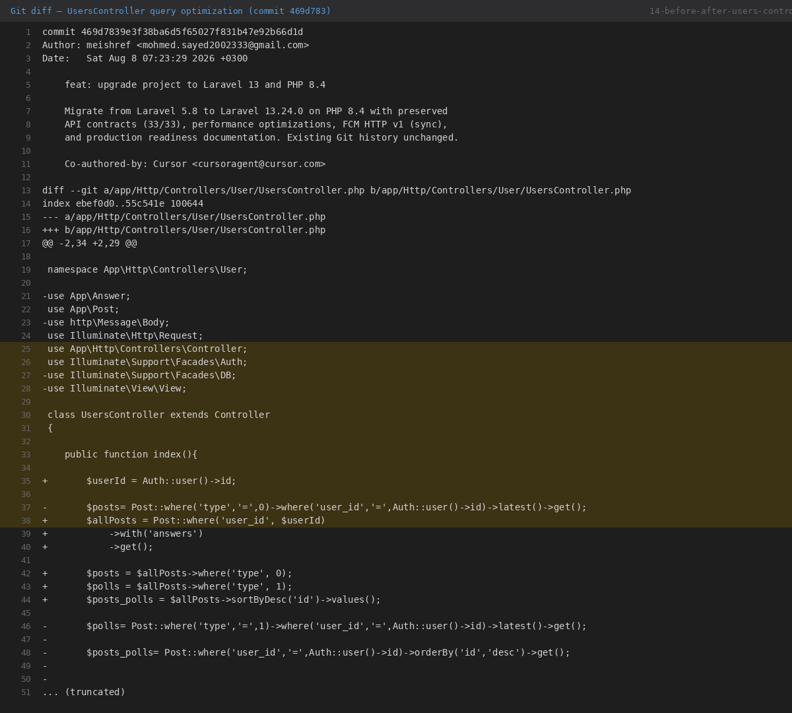

**Before (`commit 2be148b`):** Three separate `Post::where(...)` queries + N+1 lazy loading of `answers`.

**After (`commit 469d783`):** Single `Post::where('user_id')->with('answers')->get()` with PHP collection splits.

---

## 8. Database Index Optimization

### Migration

**File:** `database/migrations/2026_08_08_040705_add_performance_indexes_to_posts_and_answers_tables.php`  
**Introduced in:** `commit 469d783`

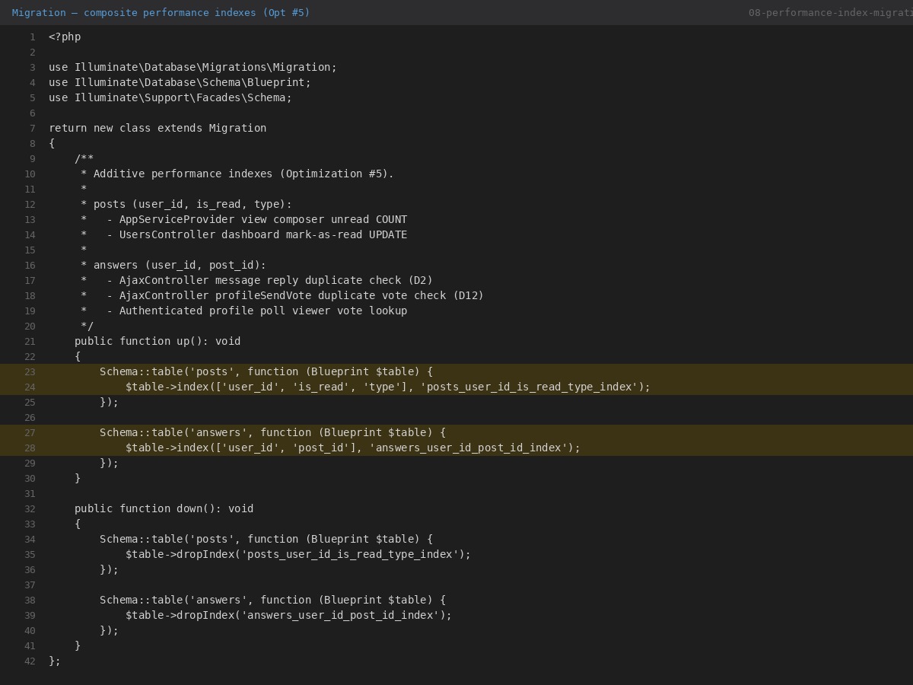

### Index 1: `posts_user_id_is_read_type_index`

| Property | Value |
|----------|-------|
| **Table** | `posts` |
| **Columns** | `(user_id, is_read, type)` |
| **Type** | Composite B-tree index |

**Queries that benefit:**

1. `AppServiceProvider` — unread COUNT:
   `WHERE user_id = ? AND is_read = 0 AND type = 0`
2. `UsersController::index()` — mark-as-read UPDATE:
   `WHERE user_id = ? AND is_read = 0`

### Index 2: `answers_user_id_post_id_index`

| Property | Value |
|----------|-------|
| **Table** | `answers` |
| **Columns** | `(user_id, post_id)` |
| **Type** | Composite B-tree index |

**Queries that benefit:**

1. `AjaxController::replyMessage()` — duplicate reply check (D2):
   `WHERE user_id = ? AND post_id = ?`
2. `AjaxController::profileSendVote()` — duplicate vote check (D12):
   `WHERE user_id = ? AND post_id = ?`
3. `profile.blade.php` — poll vote lookup:
   `WHERE user_id = ? AND post_id = ?`

### Migration status

The migration file exists in the repository. **Whether indexes are applied on a given database depends on whether `php artisan migrate` was run on that database.** Production was not migrated during this work.

---

## 9. Authentication & Security Improvements

### Authentication (preserved behavior, modernized code)

| Feature | Status |
|---------|--------|
| Session-based login | Preserved |
| Login with email **or** username | Preserved — `LoginController::username()` |
| Redirect after login → `/user` | Preserved |
| Password reset flow | Preserved |
| Registration fields | Preserved (`name`, `email`, `username`, `password`) |
| CSRF protection | Preserved (Laravel default) |

### Security improvements (IMPLEMENTED)

| Change | Before | After |
|--------|--------|-------|
| FCM server key | Hardcoded in `ProfileController` source code | Removed; moved to env-based `config/firebase.php` |
| FCM protocol | Legacy HTTP API (`fcm/send`) | Firebase HTTP v1 with OAuth2 service account JWT |
| Proxy handling | `fideloper/proxy` package | Laravel 13 built-in trusted proxies |
| Dependency CVEs | Laravel 5.8 (EOL, unpatched) | Laravel 13.24.0 (actively maintained) |

---

## 10. FCM / Notification Work

### Implemented (`commit 469d783`)

- **New service:** `app/Services/FirebaseCloudMessaging.php`
- **New config:** `config/firebase.php`
- **Env variables:** `FIREBASE_PROJECT_ID`, `FIREBASE_CLIENT_EMAIL`, `FIREBASE_PRIVATE_KEY`, `FIREBASE_REQUEST_TIMEOUT`
- **Delivery mode:** Synchronous (same as before — no queue/Redis added)
- **Notification payload:** Preserved — title, body, icon (`img/icon.png`), image (`img/d.png`)
- **Trigger:** Unchanged — `ProfileController::senMessageToUser()` when `active_notification=1` and token exists

### Tests

9 FCM tests in `tests/Feature/FcmNotificationTest.php` using `Http::fake` — no real Firebase calls.

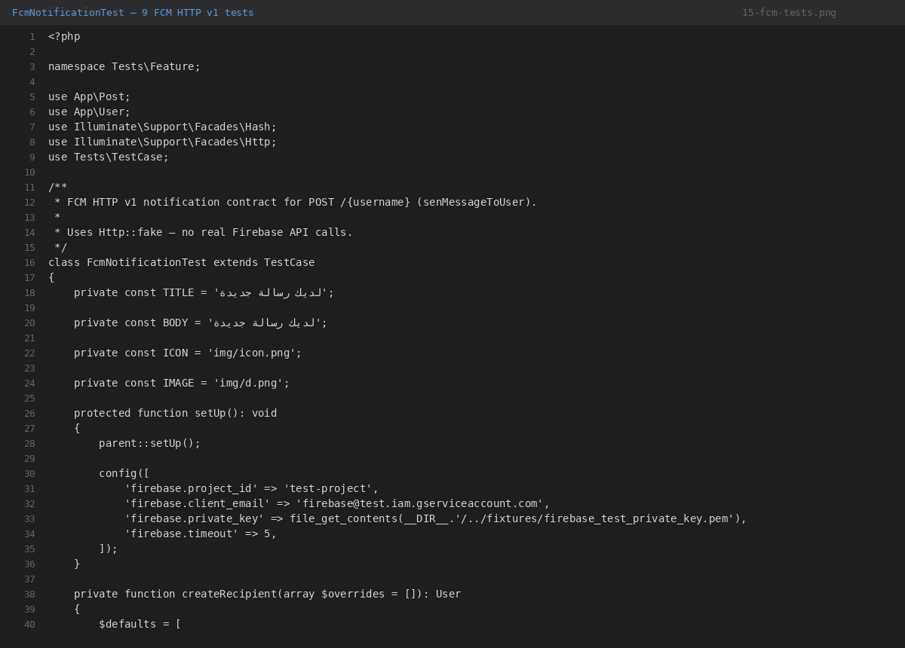

---

## 11. API Stability

### Route verification

Routes were compared between `commit 2be148b` (L5.8) and `commit 469d783` (L13) via `git diff`.

**Result:** All application endpoint URLs, HTTP methods, and route names are **preserved**. Changes were syntactic only (string → class-based references, duplicate route group removed).

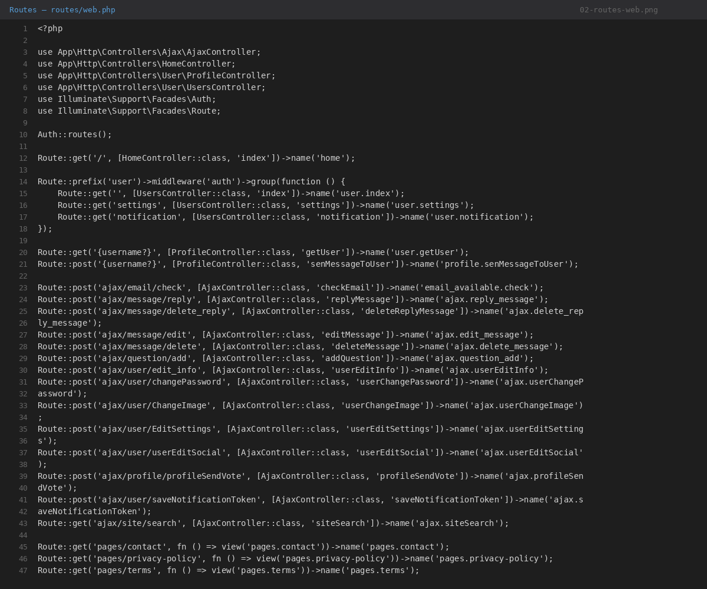

### Preserved endpoints (33 documented in `API_INVENTORY.md`)

| Group | Count | Examples |
|-------|-------|---------|
| Authentication | 9 | `GET /login`, `POST /login`, `POST /logout`, register, password reset |
| Public pages | 6 | `GET /`, `GET /{username}`, `POST /{username}`, contact, privacy, terms |
| User dashboard | 3 | `GET /user`, `GET /user/settings`, `GET /user/notification` |
| AJAX endpoints | 14 | `POST /ajax/message/reply`, `POST /ajax/profile/profileSendVote`, etc. |
| API stub | 1 | `GET /api/user` (non-functional, preserved) |

**Registered routes (current):** 36 total (includes Laravel framework routes: `/up`, `/storage/{path}`, standard auth routes).

### What was NOT changed

- Endpoint URLs
- HTTP methods
- Request parameter names
- Response JSON structures and Arabic status strings
- Authentication/session behavior
- AJAX ownership validation logic

---

## 12. Testing & Verification

### Test suite

| Test file | Tests | Assertions | Purpose |
|-----------|-------|------------|---------|
| `tests/Feature/ApiContractTest.php` | 33 | 98 | One test per documented route |
| `tests/Feature/FcmNotificationTest.php` | 9 | 30 | FCM HTTP v1 behavior |
| **Total** | **42** | **128** | |

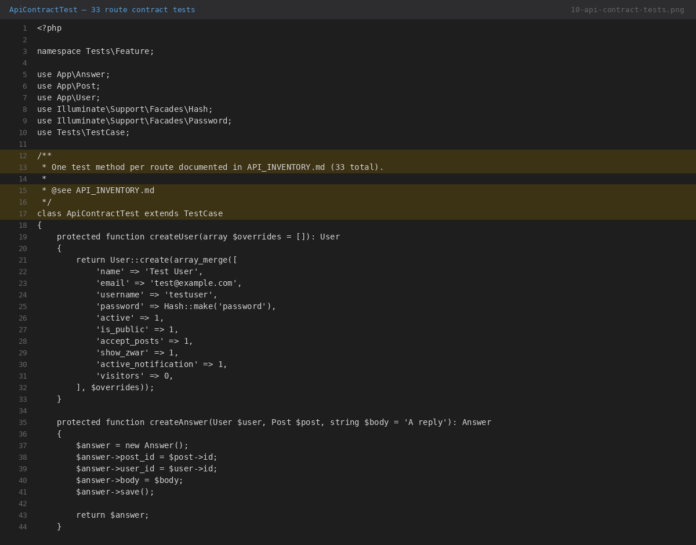

### Test results (verified 2026-08-12)

```
OK (42 tests, 128 assertions)
```

Run command: `vendor/bin/phpunit` on PHP 8.3/8.4 with test database configured.

### Performance regression gate

After each optimization, `ApiContractTest` was run. Result: **33/33 passing** after every change (documented in `PERFORMANCE.md §11`).

---

## 13. Deployment & Test Environment

| Item | Value |
|------|-------|
| Branch | `upgrade/laravel-13` |
| Laravel | 13.24.0 |
| PHP (required) | ≥ 8.3 |
| PHP (server available) | 8.2, 8.3 — **use 8.3** |
| Symfony (locked) | 7.4.x |
| Test database (local) | `akbrny_test` |
| Test database (server) | `akbrny2026_akbrny_test` |
| Production database | **Not modified** |

### Deployment notes

- Run `composer install --no-dev --optimize-autoloader` with PHP 8.3
- Do not run `composer update` on PHP 8.4 hosts without the platform pin — it may re-resolve Symfony 8.x
- Pending migrations (sessions, jobs, indexes) require explicit approval before running on any database
- Staging workaround (no migrate): `SESSION_DRIVER=file`, `QUEUE_CONNECTION=sync`, `CACHE_STORE=file`

---

## 14. Git History / Major Changes

```
* 4e4a844 (HEAD -> upgrade/laravel-13) fix(deps): align Laravel 13 dependencies with PHP 8.3
* 469d783 feat: upgrade project to Laravel 13 and PHP 8.4
* 2be148b (origin/main) old project we need to upgrade it
* 36026ee first commit
```

### Commit detail

#### `469d783` — feat: upgrade project to Laravel 13 and PHP 8.4 (2026-08-08)

- 69 files changed
- Laravel 5.8 → 13.24.0
- Query optimizations #1–#5
- FCM HTTP v1 service
- 42 tests added
- Performance baseline tooling
- Documentation (API_INVENTORY, PERFORMANCE, UPGRADE_AUDIT, PRODUCTION_READINESS)
- **Affects API behavior:** No
- **Affects database structure:** Adds 3 new migrations (jobs, sessions, indexes) — not applied to production

#### `4e4a844` — fix(deps): align Laravel 13 dependencies with PHP 8.3 (2026-08-12)

- 2 files changed (`composer.json`, `composer.lock`)
- PHP constraint: `^8.4` → `^8.3`
- Symfony: 8.1.x → 7.4.x
- **Affects API behavior:** No
- **Affects database structure:** No
- **Affects performance:** No (dependency resolution only)

---

## 15. Before vs After

| Aspect | Before (L5.8) | After (L13) |
|--------|---------------|-------------|
| Laravel | 5.8.* | 13.24.0 |
| PHP | ^7.1.3 | ^8.3 |
| Route syntax | String-based | Class-based |
| FCM | Hardcoded legacy key + cURL | HTTP v1 service + env config |
| Tests | 2 empty example tests | 42 contract + FCM tests |
| Query count GET `/user` | 18 | 5 (−72%) |
| Query count GET `/{username}` | 12 | 4 (−67%) |
| Performance indexes | None | 2 composite indexes (migration) |
| Documentation | None | 4 technical documents |
| API endpoints | 33 | 33 (preserved) |

---

## 16. Future Recommendations

> **These items are NOT implemented.** They are suggestions for future work.

| # | Recommendation | Reason |
|---|---------------|--------|
| 1 | Eager-load viewer answers for polls in controller | Eliminates N queries per poll in `profile.blade.php` |
| 2 | Add pagination to dashboard/profile post lists | Prevents memory growth as post count increases |
| 3 | Replace COUNT-then-mutate pattern in `AjaxController` | Several endpoints run COUNT then INSERT/UPDATE/DELETE (2 queries → 1) |
| 4 | Apply performance index migration on staging/production | Indexes exist in code but require `migrate` to take effect |
| 5 | Add index or full-text search for `siteSearch` | Current `LIKE '%term%'` cannot use B-tree indexes |
| 6 | Move FCM to async queue (requires infrastructure approval) | Currently synchronous — blocks response until FCM completes |
| 7 | Migrate models to `app/Models/` namespace | Laravel convention; cosmetic, no functional benefit |
| 8 | Conditional mark-as-read UPDATE | Currently runs even when no unread messages exist |

---

## 17. Evidence / Screenshots

| # | File | Description |
|---|------|-------------|
| 1 | [screenshots/01-project-structure.png](screenshots/01-project-structure.png) | Project directory structure |
| 2 | [screenshots/02-routes-web.png](screenshots/02-routes-web.png) | `routes/web.php` — all application routes |
| 3 | [screenshots/03-users-controller-queries.png](screenshots/03-users-controller-queries.png) | `UsersController` — consolidated query |
| 4 | [screenshots/04-profile-controller-queries.png](screenshots/04-profile-controller-queries.png) | `ProfileController` — optimized queries |
| 5 | [screenshots/05-ajax-controller-queries.png](screenshots/05-ajax-controller-queries.png) | `AjaxController` — reply duplicate check |
| 6 | [screenshots/06-models.png](screenshots/06-models.png) | Eloquent models and relationships |
| 7 | [screenshots/07-app-service-provider.png](screenshots/07-app-service-provider.png) | Memoized unread COUNT |
| 8 | [screenshots/08-performance-index-migration.png](screenshots/08-performance-index-migration.png) | Performance index migration |
| 9 | [screenshots/09-database-migrations.png](screenshots/09-database-migrations.png) | All migration files |
| 10 | [screenshots/10-api-contract-tests.png](screenshots/10-api-contract-tests.png) | API contract test suite |
| 11 | [screenshots/11-composer-json.png](screenshots/11-composer-json.png) | `composer.json` — PHP 8.3 + Laravel 13 |
| 12 | [screenshots/12-composer-lock-php83.png](screenshots/12-composer-lock-php83.png) | Locked Symfony 7.4 / Laravel 13.24 |
| 13 | [screenshots/13-git-history.png](screenshots/13-git-history.png) | Git commit history |
| 14 | [screenshots/14-before-after-users-controller-diff.png](screenshots/14-before-after-users-controller-diff.png) | Git diff — query optimization evidence |
| 15 | [screenshots/15-fcm-tests.png](screenshots/15-fcm-tests.png) | FCM HTTP v1 test suite |

---

*End of report.*
